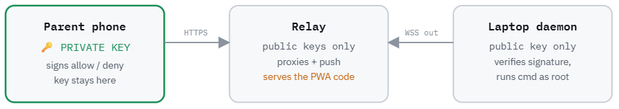

# Trust model

`parentapproval` lets a paired parent phone approve a kid’s `sudo`, or a `parentapproval ask` for some other command, without putting a password or the signing key on the kid’s computer. The only thing that can approve a request is a valid Ed25519 signature from that paired phone.

The phone has to sign an `allow`. A `deny` does not have to be signed (a kid can cancel). The relay is a switchboard: it forwards messages and sends push notifications. It stores parent public keys, a short-lived copy of the phone's secret during Safari Home Screen pairing, and a little metadata about each ask (who, which service, the match digits, a hash of the command, and when). It cannot sign an `allow` itself.

The daemon on the laptop checks those signatures. After an approval, `parentapproval ask` runs the command as root. Interactive `sudo` or polkit uses a one-shot ticket and then runs the command itself. The laptop has its own key, used only to say hello to the relay. It never signs an approval. Only the paired phone can do that.

**Self-host the relay for high-assurance use**, see below for more information.

## Principles

**Key isolation.** The private key is generated on the phone. The laptop stores only the public half. The relay stores public keys. On the Safari → Home Screen path, the pairing `secret` for the life of the pair token. A fully compromised laptop still cannot produce an approval.

**Canonical signing.** Signatures are Ed25519 over a fixed byte string, not JSON, each prefixed with its purpose:
- `OMARCHY-APPROVE/1` for decisions
- `OMARCHY-WATCH/1` for live-ask polling
- `OMARCHY-SAS/1` for the pairing short-authentication string (a hash, not a signature)

Fixed bytes remove canonicalization ambiguity, and distinct prefixes prevent one signature being reused for another protocol.

**Server rebuilds the message.** The daemon verifies each signature over the fields it has *stored*, never over client input. A decision therefore cannot be retargeted to a different command than the one the phone was shown.

**Single-use requests.** Each request id (`rid`) is 128 bits of randomness with a 120-second TTL, and only one request per user is outstanding at a time. The first valid decision spends the `rid`, any replay is refused.

**Tamper check on the phone.** Before signing, the PWA recomputes `cmd_hash` from the request it received and refuses to sign on a mismatch, catching an alteration of the request in transit.

**Hardened PAM helper.** The `pam` helper ignores `--dev` and environment overrides and pins the production socket and state paths. `pam_exec` also does not forward the kid's environment to the helper. Both are defense in depth against a kid-controlled socket or environment.

**Safe defaults.** An unauthenticated `deny` is accepted (so a kid can cancel or panic-stop), but an unauthenticated `allow` never is. Production runs no inbound listener, the laptop dials the relay outbound over WSS.

**Peer-credential gating.** Pairing and revocation require a local, non-kid, connection, checked via `SO_PEERCRED`; members of `omarchy-kids` are rejected.

## What this does not cover

The model protects against a compromised laptop and a passive network, not against a compromised relay origin (which serves the PWA and crypto code) or a stolen, unlocked parent phone. See [`SPEC.md`](SPEC.md) for the wire format and
protocol details.

As mentioned above, you can, and should run your own relay! 

## The Relay and Assurance

The relay **cannot itself sign** an `allow`. It holds parent public keys, Safari pair-handoff secrets (the phone `secret`, until the pair token expires), and ask metadata. Its power is that it is the code-delivery point and the message bus.

The signing libraries on the relay are hash-pinned with subresource integrity in `web/index.html`. Release hashes for the PWA files live in [`web-assets.md`](web-assets.md). After pairing, a parent can fetch those files and check they match a release.

The default relay on [parentapprovals.com](https://parentapprovals.com) is served using the Dockerfile in this repo. It's deployed automatically when main is updated. It is run by me ([@aphexddb](https://x.com/aphexddb)) to make life easier for people and as a public service. You can trust that I bear no-ill will, or run one yourself. 

JS code on the relay (`index.html`, `app.js`, `nacl.min.js`, `sha256.min.js`) are the bits that can use the parent's private key. A hostile or compromised relay can serve JavaScript that reads that key, or that silently signs an allow. 

### What the relay can and cannot do

| Actor | Can forge an `allow`? | Can see command text? | Can replace phone code? |
|---|---|---|---|
| Compromised laptop | No (key is on the phone) | Yes (it created the ask) | No |
| Passive network | No (TLS to the relay) | No (TLS + sealed ask) | No |
| Relay operator | Yes, by serving hostile JS | No (user/cwd/cmd/host sealed to the phone) | Yes |

Ask fields `user`, `cwd`, `cmd`, and `host_name` are NaCl-boxed to each paired phone so a hosted relay proxies opaque blobs. Approvals are still Ed25519 over `cmd_hash` of the plaintext the phone decrypted. The relay still sees metadata (`rid`, `service`, match digits, timing). Web-push bodies are generic and do not include the command. Self-host if the remaining metadata is too much.